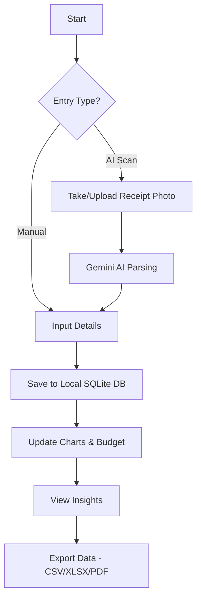

# Finance Flow 💸

**Finance Flow** is a premium, secure, and privacy-first personal finance tracker built with React Native. Unlike traditional finance apps that store your sensitive data in the cloud, Finance Flow is **local-first**, ensuring your financial life stays on your device.

## ✨ Features

- **Local-First Security**: Your data is stored locally using an encrypted SQLite database. No third-party servers, no data selling.
- **AI-Powered Entry**: Snap a photo of a receipt or screenshot, and the Gemini-powered engine automatically extracts the merchant, amount, category, and date.
- **Biometric Protection**: Secure your financial data with FaceID or TouchID.
- **Professional Analytics**: Beautiful, high-performance charts powered by React Native Skia to visualize your spending habits.
- **Budgeting**: Set monthly limits per category and get real-time progress notifications.
- **Export**: Full control over your data with CSV, XLSX, and PDF export options.

## 🔄 App Flow



## 🛠️ Tech Stack

- **Framework**: [React Native (Expo)](https://expo.dev/) & [Expo Router](https://docs.expo.dev/router/introduction/)
- **State Management**: [Zustand](https://github.com/pmndrs/zustand)
- **Database**: [Drizzle ORM](https://orm.drizzle.team/) & [Expo SQLite](https://docs.expo.dev/versions/latest/sdk/sqlite/)
- **AI Engine**: [Google Gemini Pro Vision](https://ai.google.dev/)
- **Animations**: [Reanimated 4](https://docs.swmansion.com/react-native-reanimated/)
- **Styling**: [NativeWind (Tailwind CSS)](https://www.nativewind.dev/)
- **Charts**: [React Native Skia](https://shopify.github.io/react-native-skia/)

## 🏗️ Project Structure

```text
src/
├── app/            # Expo Router (file-based navigation)
├── components/     # UI Components (Charts, Buttons, Cards, Glassmorphism)
├── core/           # Business Logic, AI Services & Hooks
├── db/             # Drizzle Schema, Migrations & SQLite Client
├── store/          # Zustand State Management (Local persistence)
└── styles/         # Global Themes & Tailwind Configuration
```

## 🚀 Getting Started

### Prerequisites

- [Node.js](https://nodejs.org/) (v18 or newer)
- [Expo Go](https://expo.dev/go) app on your mobile device or an emulator
- [Bun](https://bun.sh/) or `npm` / `yarn`

### Installation

1. Clone the repository:

   ```bash
   git clone https://github.com/dimastriann/FinanceFlow.git
   cd FinanceFlow
   ```

2. Install dependencies:

   ```bash
   npm install
   ```

3. Generate Drizzle migrations (if needed):
   ```bash
   npx drizzle-kit generate
   ```

### Running the App

Start the Expo development server:

```bash
npm run start
```

- Press `a` for Android
- Press `i` for iOS
- Press `w` for Web

### Code Formatting

This project uses Prettier for code style consistency.

```bash
npm run format        # Format all files
npm run format:check  # Check formatting status
```

## 📦 Building & Releasing

This project uses **EAS (Expo Application Services)** for cloud builds and store submissions.

### 1. Setup EAS

If you haven't already, install the EAS CLI and log in:

```bash
npm install -g eas-cli
eas login
```

Configure the project for EAS:

```bash
eas build:configure
```

### 2. Create a Build

Choose a platform and profile (defined in `eas.json`):

- **Development Build** (for testing with real device):

  ```bash
  eas build --profile development --platform android
  eas build --profile development --platform ios
  ```

- **Production Build** (for App Store/Play Store):
  ```bash
  eas build --profile production --platform android
  eas build --profile production --platform ios
  ```

### 3. Submit to Stores

Once the build is complete, you can submit it directly to the Apple App Store or Google Play Store:

```bash
eas submit --platform android
eas submit --platform ios
```

---

Built with ❤️ for privacy and financial freedom.
